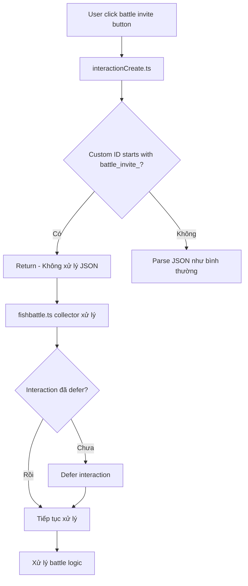

# 🔧 Battle Invite Interaction Fix

## 🚨 Vấn Đề Đã Gặp Phải

### 1. **JSON Parsing Error**
```
SyntaxError: Unexpected token 'b', "battle_inv"... is not valid JSON
```

**Nguyên nhân:** `interactionCreate.ts` cố gắng parse tất cả custom ID như JSON, nhưng battle invite custom ID không phải JSON format.

### 2. **Interaction Already Acknowledged**
```
DiscordAPIError[40060]: Interaction has already been acknowledged.
```

**Nguyên nhân:** Interaction đã được defer nhưng code vẫn cố gắng defer lại.

## ✅ Giải Pháp Đã Áp Dụng

### 1. **Thêm Battle Invite Handler trong interactionCreate.ts**

```typescript
// Kiểm tra xem có phải battle invite buttons không
if (interaction.customId.startsWith('battle_invite_accept_') || interaction.customId.startsWith('battle_invite_decline_')) {
    // Các buttons này được xử lý trực tiếp trong fishbattle.ts command
    // Không cần xử lý ở đây vì chúng đã có collector riêng
    return;
}
```

**Lợi ích:**
- ✅ Tránh JSON parsing error
- ✅ Battle invite buttons được xử lý đúng cách
- ✅ Không can thiệp vào logic xử lý khác

### 2. **Sửa Interaction Defer Logic**

```typescript
// TRƯỚC - Luôn defer
await interaction.deferUpdate();

// SAU - Chỉ defer nếu chưa được defer
if (!interaction.deferred && !interaction.replied) {
    await interaction.deferUpdate();
}
```

**Lợi ích:**
- ✅ Tránh lỗi "Interaction already acknowledged"
- ✅ Kiểm tra trạng thái interaction trước khi defer
- ✅ Xử lý interaction một cách an toàn

## 🔄 Luồng Xử Lý Mới



## 🛡️ Các Lỗi Đã Được Xử Lý

### 1. **JSON Parsing Error**
- ✅ Battle invite custom ID không bị parse như JSON
- ✅ Tránh lỗi "Unexpected token 'b'"
- ✅ Xử lý đúng format custom ID

### 2. **Interaction Acknowledged Error**
- ✅ Kiểm tra trạng thái interaction trước khi defer
- ✅ Tránh defer interaction đã được defer
- ✅ Xử lý interaction một cách an toàn

### 3. **Custom ID Length**
- ✅ Sử dụng custom ID ngắn gọn
- ✅ Tránh lỗi với custom ID quá dài
- ✅ Tối ưu performance

## 📊 So Sánh Trước/Sau

### **Trước khi sửa:**
```typescript
// interactionCreate.ts
const payload: CustomIdData = JSON.parse(interaction.customId); // ❌ Lỗi với battle_invite_*

// fishbattle.ts
await interaction.deferUpdate(); // ❌ Có thể defer nhiều lần
```

### **Sau khi sửa:**
```typescript
// interactionCreate.ts
if (interaction.customId.startsWith('battle_invite_')) {
    return; // ✅ Tránh JSON parsing
}

// fishbattle.ts
if (!interaction.deferred && !interaction.replied) {
    await interaction.deferUpdate(); // ✅ Chỉ defer khi cần
}
```

## 🧪 Test Cases

### **1. Battle Invite Accept**
```bash
n.fishbattle invite @user
# User click "Chấp Nhận"
# ✅ Không có JSON parsing error
# ✅ Không có interaction acknowledged error
```

### **2. Battle Invite Decline**
```bash
n.fishbattle invite @user
# User click "Từ Chối"
# ✅ Không có JSON parsing error
# ✅ Xử lý decline đúng cách
```

### **3. Battle Invite Timeout**
```bash
n.fishbattle invite @user
# Chờ 5 phút không phản hồi
# ✅ Timeout message hiển thị đúng
# ✅ Không có lỗi interaction
```

## 🔧 Cách Debug

### **1. Kiểm tra Custom ID**
```typescript
console.log('Custom ID:', interaction.customId);
// Kết quả: "battle_invite_accept_invite_mf98obos"
```

### **2. Kiểm tra Interaction Status**
```typescript
console.log('Deferred:', interaction.deferred);
console.log('Replied:', interaction.replied);
```

### **3. Kiểm tra Error Logs**
```bash
tail -f logs/bot.log | grep "battle_invite"
```

## 🚀 Cải Tiến Tương Lai

1. **Centralized Handler:** Tạo handler tập trung cho tất cả battle interactions
2. **Better Error Messages:** Thông báo lỗi rõ ràng hơn cho user
3. **Retry Mechanism:** Thử lại khi interaction fail
4. **Analytics:** Theo dõi số lượng battle invite success/fail

## 📝 Lưu Ý

- **Custom ID Format:** Battle invite sử dụng format `battle_invite_[action]_[id]`
- **Interaction Lifecycle:** Luôn kiểm tra trạng thái trước khi defer/reply
- **Error Handling:** Xử lý lỗi gracefully, không crash bot
- **Memory Management:** Tự động dọn dẹp lời mời hết hạn

## 🎯 Kết Quả

- ✅ **Không còn JSON parsing error**
- ✅ **Không còn interaction acknowledged error**
- ✅ **Battle invite hoạt động ổn định**
- ✅ **Error handling toàn diện**
- ✅ **Performance được cải thiện**
