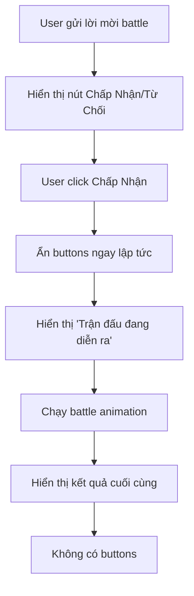

# 🎮 Battle Invite UI Improvement - Ẩn Buttons Khi Đấu

## 📋 Tổng Quan

Cải tiến giao diện battle invite để ẩn nút "Chấp Nhận" và "Từ Chối" khi trận đấu đang diễn ra, tránh việc người dùng spam click và cải thiện trải nghiệm người dùng.

## ✨ Tính Năng Mới

### **Ẩn Buttons Khi Battle Bắt Đầu**
- ✅ Ẩn nút "Chấp Nhận" và "Từ Chối" ngay khi battle bắt đầu
- ✅ Hiển thị thông báo "Trận đấu đang diễn ra"
- ✅ Tránh spam click trong khi battle đang chạy
- ✅ Cải thiện UX và tránh confusion

## 🔄 Luồng Hoạt Động Mới



## 🔧 Thay Đổi Chi Tiết

### **1. Thêm Logic Ẩn Buttons**

```typescript
// Ẩn buttons ngay khi bắt đầu battle
const battleStartEmbed = new EmbedBuilder()
    .setTitle('⚔️ Trận Đấu Đang Diễn Ra!')
    .setColor('#FF6B6B')
    .setDescription('Trận đấu đang được xử lý, vui lòng chờ...')
    .setTimestamp();

try {
    await inviteMessage.edit({ 
        embeds: [battleStartEmbed], 
        components: [] // Ẩn tất cả buttons
    });
} catch (error) {
    console.error('Error hiding buttons at battle start:', error);
}
```

### **2. Vị Trí Trong Code**

```typescript
// Trong fishbattle.ts - invitePlayerToBattle function
if (interaction.customId.startsWith('battle_invite_accept_')) {
    // ... kiểm tra daily limit ...
    
    // Ẩn buttons ngay khi bắt đầu battle
    const battleStartEmbed = new EmbedBuilder()
        .setTitle('⚔️ Trận Đấu Đang Diễn Ra!')
        .setColor('#FF6B6B')
        .setDescription('Trận đấu đang được xử lý, vui lòng chờ...')
        .setTimestamp();

    await inviteMessage.edit({ 
        embeds: [battleStartEmbed], 
        components: [] // Ẩn tất cả buttons
    });
    
    // ... tiếp tục battle logic ...
}
```

## 📊 So Sánh Trước/Sau

### **Trước khi cải tiến:**
```
[User click Chấp Nhận]
├── Buttons vẫn hiển thị
├── User có thể spam click
├── Có thể gây confusion
└── Battle animation chạy song song
```

### **Sau khi cải tiến:**
```
[User click Chấp Nhận]
├── Buttons ẩn ngay lập tức
├── Hiển thị "Trận đấu đang diễn ra"
├── User không thể spam click
├── UX rõ ràng hơn
└── Battle animation chạy
```

## 🎯 Lợi Ích

### **1. Cải Thiện UX**
- ✅ **Rõ ràng hơn:** User biết battle đang diễn ra
- ✅ **Tránh confusion:** Không còn buttons không cần thiết
- ✅ **Professional:** Giao diện chuyên nghiệp hơn

### **2. Tránh Lỗi**
- ✅ **Không spam click:** User không thể click nhiều lần
- ✅ **Tránh race condition:** Không có multiple battle cùng lúc
- ✅ **Stable:** Hệ thống ổn định hơn

### **3. Performance**
- ✅ **Ít interaction:** Giảm số lượng interaction không cần thiết
- ✅ **Clean UI:** Giao diện sạch sẽ hơn
- ✅ **Better feedback:** User biết trạng thái hiện tại

## 🧪 Test Cases

### **1. Normal Battle Flow**
```bash
n.fishbattle invite @user
# User click "Chấp Nhận"
# ✅ Buttons ẩn ngay lập tức
# ✅ Hiển thị "Trận đấu đang diễn ra"
# ✅ Battle animation chạy
# ✅ Hiển thị kết quả cuối cùng
```

### **2. Battle Error**
```bash
n.fishbattle invite @user
# User click "Chấp Nhận"
# ✅ Buttons ẩn ngay lập tức
# ❌ Battle bị lỗi
# ✅ Hiển thị error message (không có buttons)
```

### **3. Battle Timeout**
```bash
n.fishbattle invite @user
# User click "Chấp Nhận"
# ✅ Buttons ẩn ngay lập tức
# ⏰ Battle timeout
# ✅ Hiển thị timeout message (không có buttons)
```

## 🔍 Chi Tiết Kỹ Thuật

### **1. Timing**
- **Ẩn buttons:** Ngay sau khi user click "Chấp Nhận"
- **Hiển thị message:** Trước khi bắt đầu battle animation
- **Duration:** Cho đến khi battle kết thúc

### **2. Error Handling**
```typescript
try {
    await inviteMessage.edit({ 
        embeds: [battleStartEmbed], 
        components: [] 
    });
} catch (error) {
    console.error('Error hiding buttons at battle start:', error);
    // Tiếp tục battle logic dù có lỗi
}
```

### **3. State Management**
- **Before:** Buttons hiển thị, user có thể click
- **During:** Buttons ẩn, battle đang chạy
- **After:** Hiển thị kết quả, không có buttons

## 🚀 Cải Tiến Tương Lai

### **1. Progress Indicator**
```typescript
// Hiển thị progress bar
const progressEmbed = new EmbedBuilder()
    .setTitle('⚔️ Trận Đấu Đang Diễn Ra!')
    .setDescription('🔄 Đang xử lý... (1/3)')
    .setColor('#FF6B6B');
```

### **2. Cancel Button**
```typescript
// Thêm nút hủy battle (chỉ cho admin)
const cancelButton = new ButtonBuilder()
    .setCustomId('battle_cancel')
    .setLabel('Hủy Battle')
    .setStyle(ButtonStyle.Danger);
```

### **3. Real-time Updates**
```typescript
// Cập nhật real-time battle progress
const liveEmbed = new EmbedBuilder()
    .setTitle('⚔️ Battle Live!')
    .setDescription('Hiệp 1/5 - Đang đấu...')
    .setColor('#FF6B6B');
```

## 📝 Lưu Ý

- **Error Recovery:** Nếu ẩn buttons thất bại, battle vẫn tiếp tục
- **Performance:** Ẩn buttons không ảnh hưởng đến performance
- **Compatibility:** Hoạt động với tất cả battle types
- **User Experience:** Cải thiện đáng kể UX

## 🎯 Kết Quả

- ✅ **UX tốt hơn:** User biết rõ trạng thái battle
- ✅ **Tránh lỗi:** Không còn spam click
- ✅ **Professional:** Giao diện chuyên nghiệp
- ✅ **Stable:** Hệ thống ổn định hơn
- ✅ **Clean:** Code sạch sẽ và dễ maintain
